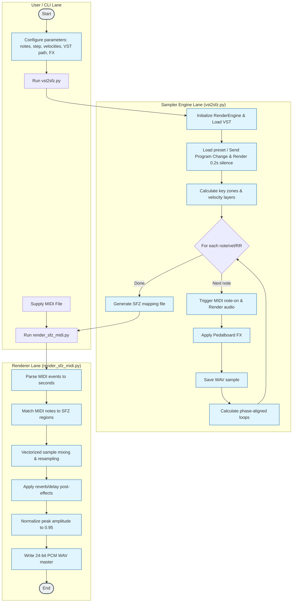

# VST2SFZ — VST Sampling and SFZ Rendering

This project is an automated Python pipeline for sampling VST plugins, generating instrument mapping files in the **SFZ** format, and rendering MIDI performances using an offline sampler engine. 

All audio processing supports high-definition rendering (up to **24-bit / 96 kHz**).

---

## 📊 BPMN Process Workflow

The diagram below illustrates the multi-lane BPMN process mapping the user actions, the automatic sampling logic inside `vst2sfz.py`, and the offline rendering pipeline inside `renderers/render_sfz_midi.py`:



---

## 📁 Project Structure

* **`vst2sfz.py`** — Main CLI utility to sample VST plugins and generate SFZ mappings automatically.
* **`test_suite.py`** — Unit tests covering edge cases, note parsing, zoning, and loop point boundary calculations.
* **`Surge_DX_Piano.sfz`** — Ready-to-use SFZ mapping file connecting WAV samples to MIDI notes and velocity zones.
* **`renderers/`** — Directory containing offline rendering scripts (can be executed from any folder):
  * **`render_melody.py`** — Offline renderer executing MIDI events directly via VST.
  * **`render_sfz_melody.py`** — Offline renderer playing Bach's Prelude using the custom SFZ sampler (no VST required).
  * **`render_sfz_gymnopedie.py`** — SFZ-based renderer for Erik Satie's "Gymnopédie No. 1".
  * **`render_sfz_moonlight.py`** — SFZ-based renderer for Beethoven's "Moonlight Sonata" (1st movement mockup).
  * **`render_sfz_midi.py`** — Universal offline renderer playing any MIDI file using the generated SFZ instrument.
* **`midi/`** — Directory containing MIDI assets:
  * **`6101-2d_moonlight_sonata_27-2_1_2_(nc)smythe.mid`** — Full Moonlight Sonata MIDI performance.
* **`.gitignore`** — Excludes heavy binary audio files (`*_samples/*.wav` and `*.wav`) from being committed to repository.

---

## 🚀 Environment Setup

Before running the scripts, make sure to activate the isolated Conda environment containing all required libraries (`dawdreamer`, `pedalboard`, `numpy`, `soundfile`, `mido`):

```bash
# Activate environment
conda activate vst2sfz
```

---

## 🎹 How to Use the Sampler (`vst2sfz.py`)

The utility is launched via the command line and accepts various options to customize the sampling process.

### Core Arguments:
* `--vst` (Required) — Absolute path to the plugin (VST3, VST2, AU).
* `--midi-program` — Sends a Program Change MIDI command on startup to select the target preset (0-127).
* `--notes` — A range or list of notes to sample (e.g., `C2-C7` or `60,64,67`).
* `--step` — Sampling step in semitones (e.g., `3` records every minor third, and key zoning stretches the samples for intermediate keys).
* `--velocities` — Comma-separated list of velocity layers (e.g., `40,80,127`).
* `--duration` — The hold duration (note-on phase) of the MIDI note in seconds.
* `--release` — The decay recording time (note-off phase) captured after release.
* `--sr` — Sample rate for rendering (e.g., `96000` or `44100`).
* `--bit-depth` — Bit depth of the WAV files (`16`, `24`, or `32`).
* `--auto-loop` — Calculates phase-aligned loop boundaries for infinite sustain inside the SFZ file.
* `--fx` — Post-processing effects chain (e.g., `reverb,delay,chorus,distortion`).

### Example: Sampling a Piano at 24-bit / 96 kHz:
```bash
python vst2sfz.py \
  --vst "/Library/Audio/Plug-Ins/VST3/Surge XT.vst3" \
  --midi-program 0 \
  --notes C2-C7 \
  --step 3 \
  --velocities 40,80,127 \
  --output-name Surge_DX_Piano \
  --sr 96000 \
  --bit-depth 24 \
  --fx reverb \
  --fx-reverb-mix 0.15
```

---

## 🎶 Launching Melody Renderers

All rendering scripts synthesize high-fidelity stereo audio in **24-bit / 96 kHz** quality and save the resulting files to the project root directory.

### 1. Rendering via original VST:
Plays Bach's Prelude using the live Surge XT plugin instance:
```bash
python renderers/render_melody.py
# Generates: Surge_DX_Piano_Melody.wav
```

### 2. Rendering via SFZ samples (Bach's Prelude):
Plays Bach's Prelude via the custom offline SFZ sampler using WAV files in `Surge_DX_Piano_samples` and the `Surge_DX_Piano.sfz` mapping:
```bash
python renderers/render_sfz_melody.py
# Generates: Surge_DX_Piano_SFZ_Melody.wav
```

### 3. Rendering via SFZ samples (Moonlight Sonata):
Plays a expressive, slow arrangement of Moonlight Sonata utilizing custom SFZ samples with deep reverb and delay:
```bash
python renderers/render_sfz_moonlight.py
# Generates: Surge_DX_Piano_SFZ_Moonlight.wav
```

### 4. Rendering via SFZ samples (Satie's Gymnopédie):
Plays Satie's relaxing "Gymnopédie No. 1" with long, natural decay tails:
```bash
python renderers/render_sfz_gymnopedie.py
# Generates: Surge_DX_Piano_SFZ_Gymnopedie.wav
```

### 5. Rendering any MIDI file via SFZ samples:
Allows rendering of arbitrary MIDI files using the custom SFZ instrument, applying peak normalization after effects:
```bash
python renderers/render_sfz_midi.py --midi midi/6101-2d_moonlight_sonata_27-2_1_2_(nc)smythe.mid --output Surge_DX_Piano_SFZ_Moonlight_Full.wav
```

---

*Developed during an automated VST sampling session.*
